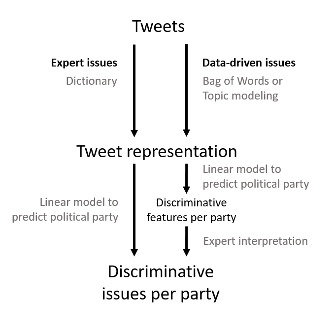

# Replication materials: Comparing automated content analysis methods to distinguish issue communication by political parties on Twitter
Replication materials for the paper "Comparing automated content analysis methods to distinguish issue communication by political parties on Twitter", authored by Stiene Praet, Walter Daelemans, Tim Kreutz, Jeroen Peeters, Peter Van Aelst, Stefaan Walgrave, and David Martens

> **Abstract:** Party competition in Western Europe is increasingly focused on “issue competition”, whichis the selective emphasis on issues by parties.  The aim of this paper is to contribute method-ologically to the increasing number of studies that deal with different aspects of parties’ issuecompetition and communication.  We systematically compare the value and shortcomings ofthree exploratory text representation approaches to study the issue communication of partieson Twitter.  More specifically, we analyze which issues separate the online communication ofone party from that of the other parties and how consistent party communication is.  Our anal-ysis was performed on two years of Twitter data from six Belgian political parties, comprisingof over 57,000 political tweets.  The results indicate that our exploratory approach is useful tostudy how political parties profile themselves on Twitter and which strategies are at play.  Sec-ondly, our method allows to analyze communication of individual politicians which contributesto classical literature on party unity and party discipline.  A comparison of our three methodsshows a clear trade-off between interpretability and discriminative power, where a combinationof all three simultaneously provides the best insights

Fig. 1: Schematic representation of the methods we propose in this paper  

## Data
- `flemish_parliamentarians` List of Flemish parliamentarians (2017) from which tweets were collected
- `20140718_dutchdictionary_v2.lcd` Dutch CAP dictionary, compiled by [Sevenans et al. (2014).](https://www.researchgate.net/publication/263732999_The_Automated_Coding_of_Policy_Agendas_A_Dictionary_Based_Approach)
- `tweet_ids` Tweet IDs from the political tweets used in this study. In line with the Twitter policy we only store tweet IDs, but the tweets can be hydrated using readily available tools such as [Hydrator](https://github.com/DocNow/hydrator).
- `json_to_excel.py` Load json file with hydrated tweets line by line and store tweet_id, screen_name, text, created_at, hashtags, mentions, and retweeted_user in excel file. You can merge this file with `tweet_ids` (to add political party per tweet) and use for analysis. 
## Analysis
- `01-preprocessing.py` Preprocessing of the text of the tweets (see section 3.2 in paper). This includes:
(1) replace named entities, mentions, numbers, and urls
(2) remove punctuation and stopwords (Dutch, French, and English)
(3) normalize (reduce to word lemma)
- `02-expert_issues.py` Discriminative power and the most discriminative issues per political party when applying the models based on expert issues (Table 6 and Table 7 of the paper) 
- `03-BoW.py` Discriminative power and the most discriminative words per political party when applying the models based on Bag of Words (Table 7 and C1 of the paper) 
- `04-topic_models.py` Discriminative power and the most discriminative topics per political party when applying the models based on topic modeling (Table 7 and C2 of the paper)

